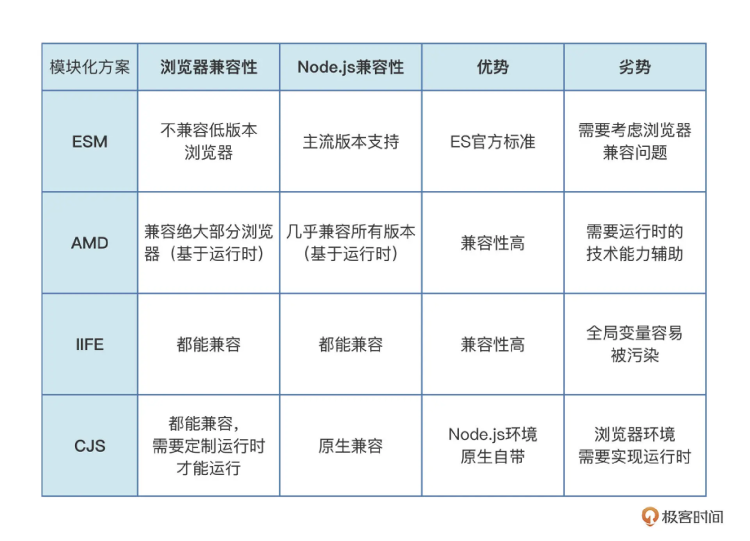

### 背景

为什么前端会有这么多模块化方案？主要原因就是ES5及之前是不支持模块化的。

### IIFE

IIFE，全称是 Immediately Invoked Function Expression，“立即执行函数”的意思。如果要实现模块化，就需要在 IIFE 中，把代码挂载在全局变量上。

这也是早期 JavaScript 的模块化方案，根据不同环境，把模块全部挂载在对应环境的全局变量上，浏览器就挂载在“window”对象上，Node.js 就挂载在 global 全局变量上。

### CommonJS[CJS]

CJS，全称是 CommonJS 模块化规范，目前用的比较广泛是在 Node.js 环境里，因为 Node.js 刚诞生的时候，模块化方案是基于 CommonJS 规范来实现的，而且，CJS 规范也是在 ES6 草案确定之前诞生的、兼容 ES5 的环境。

### AMD

AMD，全称是 Asynchronous Module Definition，“异步模块定义”，是一种面向浏览器运行的模块化方案。

AMD 在 ES6 还没出现之前，是 ES5 环境下常见用的模块化方案。这里提到的“异步模块”，是指按模块的依赖来异步加载 AMD 模块，等待依赖模块异步加载完，就开始执行主体代码。全程的运行时执行过程，都是基于 ES5 的语法能力来实现的。但是，AMD 只是一种技术方案，也就是规范，具体技术实现需要根据规范，实现其运行时。目前主流的 AMD 技术框架有 RequireJS。

### CMD
### UMD
### ES6 Modules【ESM】【ES6M】

export需要注意ES6 module是向外抛的值的引用，是引用。（这和CommonJS模块不一样，CommonJS是向外抛的值的拷贝）

export语句输出的接口，与其对应的值是动态绑定关系，即通过该接口，可以取到模块内部实时的值。这一点与 CommonJS 规范完全不同。CommonJS 模块输出的是值的缓存，不存在动态更新。

export命令可以出现在模块的任何位置，只要处于模块顶层就可以。如果处于块级作用域内，就会报错，import命令也是如此。这是因为处于条件代码块之中，就没法做静态优化了，违背了 ES6 模块的设计初衷【静态编译】。

### 参考

1. [前端工程化：CommonJS、AMD、CMD、UMD和ES Modules的区别](https://blog.csdn.net/leelxp/article/details/108101442)
