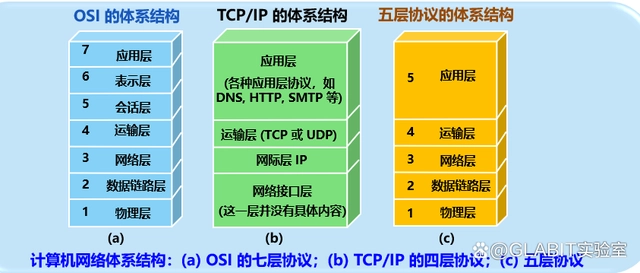

### 简介

虚拟专用网络(VPN)的功能是：在公用网络上建立专用网络，进行加密通讯。在企业网络中有广泛应用。VPN 网关通过对数据包的加密和数据包目标地址的转换实现远程访问。VPN 可通过服务器、硬件、软件等多种方式实现。

VPN 属于远程访问技术，简单地说就是利用公用网络架设专用网络。例如某公司员工出差到外地，他想访问企业内网的服务器资源，这种访问就属于远程访问。

让外地员工访问到内网资源，利用 VPN 的解决方法就是在内网中架设一台 VPN 服务器。外地员工在当地连上互联网后，通过互联网连接 VPN 服务器，然后通过 VPN 服务器进入企业内网。为了保证数据安全，VPN 服务器和客户机之间的通讯数据都进行了加密处理。有了数据加密，就可以认为数据是在一条专用的数据链路上进行安全传输，就如同专门架设了一个专用网络一样，但实际上 VPN 使用的是互联网上的公用链路，因此 VPN 称为虚拟专用网络，其实质上就是利用加密技术在公网上封装出一个数据通讯隧道。有了 VPN 技术，用户无论是在外地出差还是在家中办公，只要能上互联网就能利用 VPN 访问内网资源，这就是 VPN 在企业中应用得如此广泛的原因。

### 分类

#### 按 VPN 的协议分类

VPN 的隧道协议主要有三种，PPTP、L2TP 和 IPSec，其中 PPTP 和 L2TP 协议工作在 OSI 模型的第二层，又称为二层隧道协议；IPSec 是第三层隧道协议。

### OpenVPN

OpenVPN 是一个基于 OpenSSL 库的**_应用层_** VPN 实现。和传统 VPN 相比，它的优点是简单易用。

OpenVpn 的技术核心是虚拟网卡，其次是 SSL 协议实现。

对虚拟网卡及其在 OpenVpn 的中的工作机理进行介绍：

虚拟网卡是使用网络底层编程技术实现的一个驱动软件，安装后在主机上多出现一个网卡，可以像其它网卡一样进行配置。服务程序可以在应用层打开虚拟网卡，如果应用软件（如 IE）向虚拟网卡发送数据，则服务程序可以读取到该数据，如果服务程序写合适的数据到虚拟网卡，应用软件也可以接收得到。虚拟网卡在很多的操作系统下都有相应的实现，这也是 OpenVpn 能够跨平台一个很重要的理由。

在 OpenVpn 中，如果用户访问一个远程的虚拟地址（属于虚拟网卡配用的地址系列，区别于真实地址），则操作系统会通过路由机制将数据包（TUN 模式）或数据帧（TAP 模式）发送到虚拟网卡上，服务程序接收该数据并进行相应的处理后，通过 SOCKET 从外网上发送出去，远程服务程序通过 SOCKET 从外网上接收数据，并进行相应的处理后，发送给虚拟网卡，则应用软件可以接收到，完成了一个单向传输的过程，反之亦然。

https://community.openvpn.net/openvpn

### 对比

IPSec 协议工作在 OSI 模型的第三层，使其在单独使用时适于保护基于 TCP 或 UDP 的协议（如安全套接子层（SSL）就不能保护 UDP 层的通信流）。这就意味着，与传输层或更高层的协议相比，IPSec 协议必须处理可靠性和分片的问题，这同时也增加了它的复杂性和处理开销。相对而言，SSL/TLS 依靠更高层的 TCP（OSI 的第四层）来管理可靠性和分片。

### 参考

- [百度百科-VPN](https://baike.baidu.com/item/%E8%99%9A%E6%8B%9F%E4%B8%93%E7%94%A8%E7%BD%91%E7%BB%9C/8747869?fromtitle=VPN&fromid=382304&fr=aladdin#reference-2)
- [百度百科-OpenVPN](https://baike.baidu.com/item/OpenVPN/10718662?fr=aladdin)
- [w3cshool-报文格式大全](https://www.w3cschool.cn/completemessageformat/)
