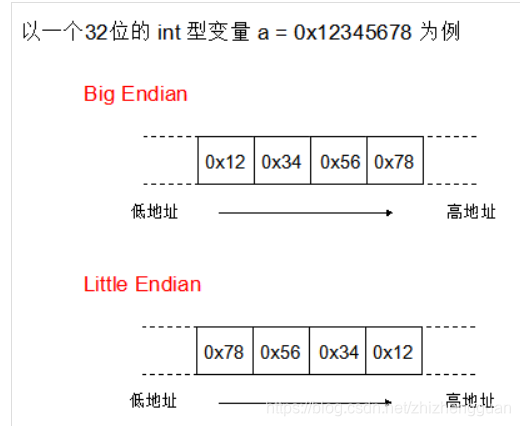

# 字节序 Big Endian Little Endian

字节序，也就是字节的顺序，指的是多字节的数据在内存中的存放顺序。

在几乎所有的机器上，多字节对象都被存储为连续的字节序列。例如：如果 C/C++中的一个 int 型变量 a 的起始地址是&a = 0x100，那么 a 的四个字节将被存储在存储器的 0x100, 0x101, 0x102, 0x103 位置。

根据整数 a 在连续的 4 byte 内存中的存储顺序，字节序被分为大端序（Big Endian） 与 小端序（Little Endian）两类。 然后就牵涉出两大 CPU 派系：

Motorola 6800，PowerPC 970，SPARC（除 V9 外）等处理器采用 Big Endian 方式存储数据；
x86 系列，VAX，PDP-11 等处理器采用 Little Endian 方式存储数据。
另外，还有一些处理器像 ARM, DEC Alpha 的字节序是可配置的。

### 大端与小端

- Big Endian 是指低地址端 存放 高位字节。
- Little Endian 是指低地址端 存放 低位字节。

### 两种字节序：网络序和主机序

网络字节序：TCP/IP 各层协议将字节序定义为 Big Endian，因此 TCP/IP 协议中使用的字节序是大端序。是确定的

主机字节序：整数在内存中存储的顺序，由 CPU 架构决定，可能是小端，也可能是大端，常用的 Intel 与 AMD 的 CPU 均为小端字节序。

在进行网络通信时 通常需要调用相应的函数进行主机序和网络序的转换。

### 参考

- [字节序：Big Endian 和 Little Endian](https://blog.csdn.net/zhizhengguan/article/details/107887396)
