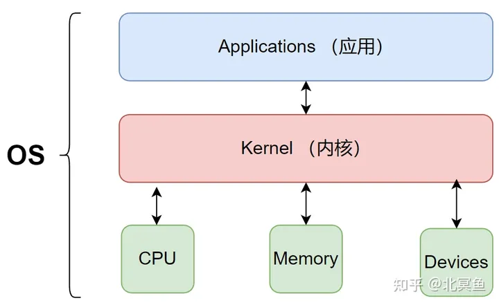

### 什么是内核

说到操作系统，就必须说内核。内核是操作系统中应用连接硬件设备的桥梁。

内核仅仅是操作系统的一部分，是真正与硬件交互的那部分软件，与硬件交互包括读写硬盘、读写网盘、读写内存以及任何连接到系统中的硬件。

除了与硬件交互外，内核还负责分配资源，分配什么资源呢？所谓资源就是硬件，比如 CPU 时间、内存、IO 等等，这些都是资源。

- [知乎-计算机系统：操作系统内核](https://zhuanlan.zhihu.com/p/608739855)

### Linux 内核调优

#### ip_forward

IP forward 是一种内核态设置，允许将一个接口的流量转发到另外一个接口。

出于安全考虑，Linux 系统默认是禁止数据包转发的。所谓转发即当主机拥有多于一块的网卡时，其中一块收到数据包，根据数据包的目的 ip 地址将数据包发往本机另一块网卡，该网卡根据路由表继续发送数据包。这通常是路由器所要实现的功能。

### 参考

- [lxlinux-Linux 内核调优](https://www.lxlinux.net/311.html)
- [lxlinux-Linux 常用内核网络参数及修改方法](https://www.lxlinux.net/307.html)
- [lxlinux-高并发场景下的 Linux 系统调优](https://www.lxlinux.net/305.html)
