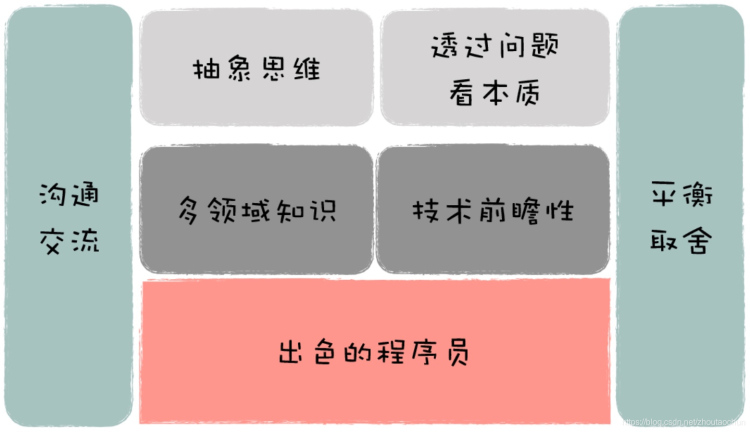

### 定义

架构这个词最早是跟随着建筑出现的，进入到软件行业后，它的含义有了一些变化，但最基础的含义还是没有变的。本质上来说，架构是一个设计动作和实现动作；设计动作描述的是勾勒出满足客户战略规划需求的产品；实现动作描述的是将构件组合成结构的过程。

### 分类

依据架构的定义，可以将架构分类为产品架构和软件架构两个大类。
在这两个大类下，还可以继续划分子类，如下：
#### 产品架构

- 业务架构

- 应用架构

- 解决方案架构

#### 软件架构

- 数据架构

- 基础结构架构

- 特定技术架构

上面只是列出了一部分架构子分类，理论上还可以继续划分，但在大多数的实际生产中，通常不会有这么详细的分类，常态是软件架构与产品架构都由一个人负责实现。

### 架构师的能力

### 参考

1. [架构的本质](https://chunsoft.blog.csdn.net/article/details/112793766)
